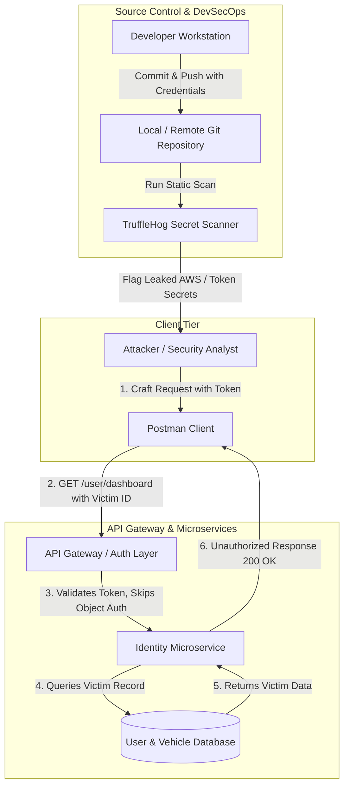

# Lab 03: API Security and Keeping Secrets Safe

## Aim
To identify and exploit Broken Object Level Authorization (BOLA / IDOR) vulnerabilities within modern RESTful web APIs and execute automated static credential scanning across source code repositories to prevent secret leakage into version control history.

---

## Architecture Diagram



---

## Tools Required
* **Postman Client:** For API testing, header manipulation, and payload crafting.
* **TruffleHog (CLI):** Deep Git-history secret scanner with live API verification.
* **Git:** Version control client.

---

## Execution Steps

### 1. Tool Installation

#### Install Postman
```bash
# Ubuntu / Debian
sudo snap install postman
```

#### Install TruffleHog CLI
```bash
curl -sSfL [https://raw.githubusercontent.com/trufflesecurity/trufflehog/main/scripts/install.sh](https://raw.githubusercontent.com/trufflesecurity/trufflehog/main/scripts/install.sh) | sudo sh -s -- -b /usr/local/bin
```

---

### 2. Broken Object Level Authorization (BOLA) Exploitation

1. Open **Postman** and configure a `GET` request to:
   ```text
   [http://demo.crapi.apisec.ai/identity/api/v2/user/dashboard](http://demo.crapi.apisec.ai/identity/api/v2/user/dashboard)
   ```
2. In the **Headers** tab, supply the authorization header:
   * **Key:** `Authorization`
   * **Value:** `Bearer <CAPTURED_USER_TOKEN>`
3. Tamper with the user identifier in the request parameter to access another user's profile:
   ```text
   [http://demo.crapi.apisec.ai/identity/api/v2/user/dashboard?user_id=8841](http://demo.crapi.apisec.ai/identity/api/v2/user/dashboard?user_id=8841)
   ```
4. Click **Send** and confirm access to the victim's private profile and vehicle records.

---

### 3. Static Secret Scanning with TruffleHog

1. Open your terminal and navigate to the project repository:
   ```bash
   cd ~/api-secret-lab
   ```
2. Execute TruffleHog against the local Git tree:
   ```bash
   trufflehog git file://. --only-verified
   ```
3. Inspect the terminal summary to identify leaked credentials, file locations, and commit metadata.

---

## Screenshots

### 1. Postman BOLA Authorization Bypass


### 2. TruffleHog Verified Secret Detection


---

## Result
* Successfully probed and exploited a Broken Object Level Authorization (BOLA) flaw in the target API, demonstrating how missing authorization checks allow unauthorized access to sensitive user data.
* Statically analyzed Git commit logs using TruffleHog, identifying and verifying hardcoded cloud service credentials before deployment.
